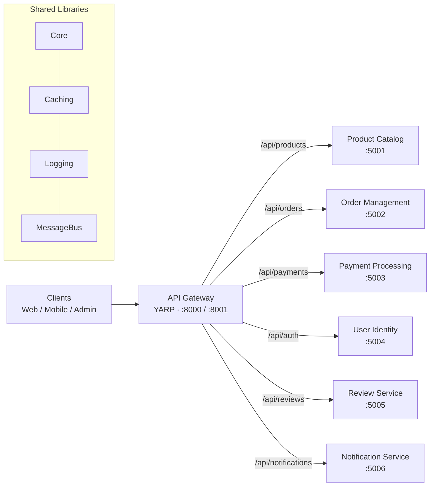

# MicroMart — Microservices Backend


MicroMart is an e-commerce platform built on a **microservices architecture** with **ASP.NET Core (.NET 10)**. A single **API Gateway**, built on Microsoft's **YARP** reverse proxy, is the entry point for all clients. It routes requests to independent domain services for products, orders, payments, identity, reviews, and notifications, and handles cross-cutting concerns such as authentication, rate limiting, resilience, health monitoring, and request tracing.

> **Status:** Active development. The API Gateway is functional and carries most of the infrastructure work. The domain services are scaffolded and ready for their business logic to be implemented.

---

## Table of Contents

- [Architecture](#architecture)
- [Services](#services)
- [API Gateway Features](#api-gateway-features)
- [Tech Stack](#tech-stack)
- [Project Structure](#project-structure)
- [Getting Started](#getting-started)
- [Configuration](#configuration)
- [Gateway Endpoints](#gateway-endpoints)
- [Roadmap](#roadmap)
- [Author](#author)

---

## Architecture



Clients never talk to services directly. Every request enters through the gateway, which applies correlation IDs, logging, rate limiting, CORS, and JWT validation before YARP forwards it to the right downstream cluster. Outgoing calls are wrapped in a Polly resilience pipeline (retry, timeout, circuit breaker), and the gateway continuously checks downstream health.

---

## Services

| Service | Project | Type | Gateway route | Expected port |
|---|---|---|---|---|
| API Gateway | `MicroMart.ApiGateway` | ASP.NET Core Web API + YARP | — | `8000` (HTTP), `8001` (HTTPS) |
| Product Catalog | `MicroMart.ProductCatalog` | Minimal API | `/api/products/**` | `5001` |
| Order Management | `MicroMart.OrderManagement` | Minimal API | `/api/orders/**` | `5002` |
| Payment Processing | `MicroMart.PaymentProcessing` | Minimal API | `/api/payments/**` | `5003` |
| User Identity | `MicroMart.UserIdentity` | Minimal API | `/api/auth/**` | `5004` |
| Review Service | `MicroMart.ReviewService` | Minimal API | `/api/reviews/**` | `5005` |
| Notification Service | `MicroMart.NotificationService` | Worker Service (background) | `/api/notifications/**` | `5006` |

Shared class libraries under `src/Shared` (`Core`, `Caching`, `Logging`, `MessageBus`) are reserved for code common to all services, such as base types, Redis caching, logging setup, and asynchronous messaging between services.

---

## API Gateway Features

**Routing and load balancing.** Routes are defined in JSON and loaded by YARP at startup with hot reload. Clusters support `RoundRobin` and `LeastRequests` load balancing, and active health checks can take unhealthy destinations out of rotation. A custom `YarpRouteFilter` prevents proxy routes from shadowing the gateway's own `/swagger` and `/health` endpoints.

**Resilience.** Outgoing proxy calls use a Polly pipeline with 3 retries and exponential backoff, a 30-second timeout, and a circuit breaker that opens at a 50% failure rate over a 30-second window.

**Security.** JWT bearer authentication validates issuer, audience, lifetime, and signing key. An API key validation service checks keys against configuration, and a named CORS policy (`GatewayCorsPolicy`) controls which front-end origins may call the gateway.

**Rate limiting.** IP-based rate limiting with `AspNetCoreRateLimit`, configured in `rate-limits.json`. It honours `X-Forwarded-For` for the real client IP and `X-ClientId` for client identification, returning `429 Too Many Requests` when a limit is exceeded.

**Observability.** Structured logging with Serilog to the console and daily rolling files (`logs/`), a correlation ID middleware that reads or generates `X-Correlation-Id` and echoes it on the response, detailed request logging, and OpenTelemetry tracing and metrics for ASP.NET Core and outgoing HTTP calls.

**Health checks.** A `/health` endpoint aggregating a self-check, a memory check, and a downstream check that pings each service's `/health` endpoint, marking services as required or optional.

**Error handling and caching.** A global `IExceptionHandler` returns consistent Problem Details responses, and output caching is enabled with a 60-second default policy.

---

## Tech Stack

| Area | Technology |
|---|---|
| Runtime | .NET 10, ASP.NET Core |
| Reverse proxy | YARP (`Yarp.ReverseProxy` 2.3) |
| Resilience | Polly 8, `Microsoft.Extensions.Http.Resilience` |
| Authentication | JWT Bearer (`Microsoft.AspNetCore.Authentication.JwtBearer`), API keys |
| Rate limiting | `AspNetCoreRateLimit` |
| Logging | Serilog (console and file sinks) |
| Telemetry | OpenTelemetry (tracing and metrics) |
| Health checks | ASP.NET Core Health Checks, `AspNetCore.HealthChecks.UI.Client` |
| Caching | Output caching, in-memory cache, StackExchange.Redis (planned use) |
| Service discovery | Consul client (planned), Kubernetes (planned) |
| API docs | Swashbuckle (gateway), `Microsoft.AspNetCore.OpenApi` (services) |

---

## Project Structure

```
MicroMart/
├── MicroMart.slnx                          # Solution file
└── src/
    ├── ApiGateway/                          # YARP-based API Gateway
    │   ├── Configuration/
    │   │   ├── ReverseProxy/                # routes.json, clusters.json, destinations.json
    │   │   ├── RateLimiting/                # rate-limits.json, policy provider
    │   │   ├── Security/                    # JWT, API key, CORS config models
    │   │   └── ServiceDiscovery/            # Consul and Kubernetes config models
    │   ├── Controllers/                     # Health, Gateway, Metrics, rate-limit debug
    │   ├── Extensions/                      # DI and pipeline registration
    │   ├── Filters/                         # API key, rate limit, model validation
    │   ├── HealthChecks/                    # Downstream and memory checks
    │   ├── Middleware/                      # Correlation ID, logging, exceptions, YARP filter
    │   ├── Models/                          # Options and response models
    │   ├── Services/                        # API key validation, service discovery, rate limiting
    │   ├── Transforms/                      # YARP request transforms
    │   └── Program.cs
    ├── Services/
    │   ├── ProductCatalog/src/WebAPI/
    │   ├── OrderManagement/src/WebAPI/
    │   ├── PaymentProcessing/src/WebAPI/
    │   ├── UserIdentity/src/WebAPI/
    │   ├── ReviewService/src/WebAPI/
    │   └── NotificationService/src/Worker/
    └── Shared/
        ├── MicroMart.Shared.Core/
        ├── MicroMart.Shared.Caching/
        ├── MicroMart.Shared.Logging/
        └── MicroMart.Shared.MessageBus/
```

Each service lives in its own folder with its own project, configuration, and launch settings, so it can be built, deployed, and scaled independently.

---

## Getting Started

### Prerequisites

- [.NET 10 SDK](https://dotnet.microsoft.com/download)
- An IDE such as Visual Studio 2022 (17.14+), JetBrains Rider, or VS Code with C# Dev Kit
- Optional: Redis and Consul, for the planned distributed caching and service discovery features

### Clone and build

```bash
git clone https://github.com/siqbalk/MicroMart.git
cd MicroMart
dotnet restore MicroMart.slnx
dotnet build MicroMart.slnx
```

### Run the gateway

```bash
dotnet run --project src/ApiGateway
```

The gateway listens on `http://localhost:8000` and `https://localhost:8001`. In the Development environment, Swagger UI is available at `http://localhost:8000/swagger`.

### Run the services

The gateway expects each service on the port listed in [Services](#services). Each service's `launchSettings.json` currently uses a different, auto-generated port, so pass the expected URL when starting them:

```bash
dotnet run --project src/Services/ProductCatalog/src/WebAPI    --urls http://localhost:5001
dotnet run --project src/Services/OrderManagement/src/WebAPI   --urls http://localhost:5002
dotnet run --project src/Services/PaymentProcessing/src/WebAPI --urls http://localhost:5003
dotnet run --project src/Services/UserIdentity/src/WebAPI      --urls http://localhost:5004
dotnet run --project src/Services/ReviewService/src/WebAPI     --urls http://localhost:5005
dotnet run --project src/Services/NotificationService/src/Worker
```

In Visual Studio, you can instead right-click the solution, choose **Configure Startup Projects**, and select **Multiple startup projects**.

### Try it

```bash
# Gateway health (self, memory, downstream services)
curl http://localhost:8000/health

# A request proxied through the gateway to the Product Catalog service
curl -H "X-Correlation-Id: demo-123" http://localhost:8000/api/products/
```

---

## Configuration

Gateway configuration is split across several files so each concern can be changed on its own:

| File | Purpose |
|---|---|
| `src/ApiGateway/appsettings.json` | Logging, Serilog, gateway options, JWT, API keys, Kestrel endpoints |
| `src/ApiGateway/Configuration/ReverseProxy/routes.json` | YARP routes and their destination clusters (loaded at startup, hot-reloaded) |
| `src/ApiGateway/Configuration/ReverseProxy/clusters.json` | Extended cluster definitions with load balancing and active health checks |
| `src/ApiGateway/Configuration/RateLimiting/rate-limits.json` | IP rate limiting rules |

### Adding a new route

Add a route and its cluster to `routes.json`:

```json
{
  "RouteId": "api-inventory",
  "ClusterId": "inventory-cluster",
  "Match": { "Path": "/api/inventory/{**remainder}" }
}
```

```json
{
  "ClusterId": "inventory-cluster",
  "Destinations": {
    "destination1": { "Address": "http://localhost:5007/" }
  }
}
```

### Rate limits

The default rules allow **4 requests per minute** and **1,000 requests per hour** per client IP across all endpoints. The per-minute limit is intentionally low for testing and should be raised before real use:

```json
"GeneralRules": [
  { "Endpoint": "*", "Period": "1m", "Limit": 4 },
  { "Endpoint": "*", "Period": "1h", "Limit": 1000 }
]
```

### Secrets

> ⚠️ The JWT signing secret and sample API keys in `appsettings.json` are **development placeholders only**. For any shared or deployed environment, move them to [.NET User Secrets](https://learn.microsoft.com/aspnet/core/security/app-secrets), environment variables, or a vault such as Azure Key Vault, and rotate the committed values.

```bash
cd src/ApiGateway
dotnet user-secrets init
dotnet user-secrets set "Security:Jwt:Secret" "<your-strong-secret>"
```

CORS origins are currently set in `ServiceCollectionExtensions.AddSecurityServices` (`http://localhost:3000` and `http://localhost:8080`). Update them to match your front-end.

---

## Gateway Endpoints

| Method | Path | Description |
|---|---|---|
| `GET` | `/health` | Aggregated health report (self, memory, downstream) |
| `GET` | `/api/health` | Basic gateway health |
| `GET` | `/api/health/detailed` | Detailed gateway health information |
| `GET` | `/api/health/services` | Health of each downstream service |
| `GET` | `/api/debug/config` | Current rate limit configuration (for debugging) |
| `GET` | `/api/debug/test` | Rate limit test endpoint |
| `GET` | `/swagger` | Swagger UI (Development only) |
| `*` | `/api/{service}/**` | Proxied to the matching downstream service |

---

## Roadmap

- [x] API Gateway with YARP routing and load balancing
- [x] Polly resilience pipeline (retry, timeout, circuit breaker)
- [x] JWT and API key security, CORS
- [x] IP-based rate limiting
- [x] Serilog logging, correlation IDs, OpenTelemetry
- [x] Aggregated and downstream health checks
- [ ] Implement domain logic in each service (replacing the template endpoints)
- [ ] Align service launch ports with the gateway configuration
- [ ] Add `/health` endpoints to each downstream service
- [ ] Database per service with Entity Framework Core
- [ ] Asynchronous messaging via `Shared.MessageBus` (e.g. RabbitMQ or Azure Service Bus)
- [ ] Distributed rate limiting and caching with Redis
- [ ] Service discovery with Consul or Kubernetes
- [ ] Docker Compose for local orchestration
- [ ] CI/CD pipeline with GitHub Actions
- [ ] Unit and integration tests

---

## Author

**Syed Iqbal** — Senior Full-Stack .NET Developer

[](https://www.linkedin.com/in/syed--iqbal/)
[](https://github.com/siqbalk)
