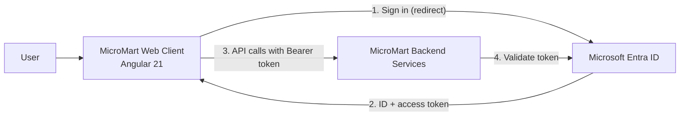

# MicroMart — Web Client


MicroMart is an e-commerce management platform built on a microservices architecture. This repository contains the **Angular web client**: an admin-style dashboard for managing products, orders, and customers, secured with **Microsoft Entra ID** (formerly Azure AD) using OAuth 2.0 and OpenID Connect.

> **Status:** Active development. Authentication, the application shell, and routing are in place; feature modules are being built out against the backend services.

---

## Table of Contents

- [Features](#features)
- [Architecture](#architecture)
- [Tech Stack](#tech-stack)
- [Project Structure](#project-structure)
- [Getting Started](#getting-started)
- [Configuration](#configuration)
- [Available Scripts](#available-scripts)
- [Roadmap](#roadmap)

---

## Features

- **Enterprise single sign-on** with Microsoft Entra ID via MSAL (redirect flow)
- **Automatic access-token injection** into API calls using `MsalInterceptor`, scoped to protected backend resources
- **Route protection** with a functional `authGuard` wrapping `MsalGuard`
- **Auth bootstrapping at startup** through `APP_INITIALIZER`, so redirect responses are processed and the active account is restored before the app renders
- **Signal-based auth state** for reactive UI updates (user name, login/logout controls)
- **Standalone components and lazy-loaded feature routes** for a small initial bundle
- **Application shell** with sidebar navigation shown only to authenticated users

---

## Architecture



The client never handles credentials directly. Users authenticate with Entra ID, and MSAL acquires an access token for the `access_as_user` scope. The interceptor attaches that token to requests sent to protected API endpoints, and the backend validates it before serving data.

---

## Tech Stack

| Area | Technology |
|---|---|
| Framework | Angular 21 (standalone components, signals) |
| Language | TypeScript 5.9 |
| Authentication | Microsoft Entra ID, `@azure/msal-angular`, `@azure/msal-browser` |
| HTTP | Angular `HttpClient` with DI-based interceptors |
| Reactive programming | RxJS 7.8, Angular Signals |
| Testing | Vitest with jsdom |
| Styling | SCSS |

---

## Project Structure

```
src/app/
├── core/                         # App-wide singletons and infrastructure
│   ├── auth/
│   │   ├── auth.config.ts        # MSAL configuration and login scopes
│   │   └── login.component.ts
│   ├── guards/
│   │   └── auth.guard.ts         # Functional route guard (wraps MsalGuard)
│   ├── http/
│   │   └── api-client.service.ts # Backend API client
│   ├── layout/
│   │   └── shell/                # Main layout: sidebar, navbar, content area
│   └── services/
│       └── auth.service.ts       # MSAL init, login/logout, signal-based user state
├── features/                     # Lazy-loaded business features
│   └── products/
│       ├── pages/                # Routed page components
│       ├── services/             # Feature-specific data services
│       └── routes.ts
├── app.config.ts                 # Providers: router, HttpClient, MSAL, initializer
├── app.routes.ts                 # Top-level routes
└── app.ts                        # Root component
```

The codebase follows a **core / features** split: `core` holds cross-cutting concerns loaded once (authentication, HTTP, layout), while each folder in `features` is a self-contained, lazy-loaded area of the application.

---

## Getting Started

### Prerequisites

- **Node.js** 20.19+ or 22.12+
- **npm** 11+
- **Angular CLI** 21 (`npm install -g @angular/cli`)
- A **Microsoft Entra ID** tenant with app registrations (see [Configuration](#configuration))

### Installation

```bash
git clone https://github.com/siqbalk/micro-mart.git
cd micro-mart
npm install
```

### Run locally

```bash
npm start
```

Open [http://localhost:4200](http://localhost:4200) and sign in with an account from your Entra ID tenant.

---

## Configuration

Two app registrations are required in Microsoft Entra ID:

1. **API registration** for the backend. Under *Expose an API*, add a scope named `access_as_user`.
2. **SPA registration** for this client. Add `http://localhost:4200` as a *Single-page application* redirect URI, then grant it permission to the API's `access_as_user` scope.

Then update the following values:

| Setting | File | Description |
|---|---|---|
| `clientId` | `src/app/core/auth/auth.config.ts` | Application (client) ID of the SPA registration |
| `authority` | `src/app/core/auth/auth.config.ts` | `https://login.microsoftonline.com/<tenant-id>` |
| `redirectUri` | `src/app/core/auth/auth.config.ts` | Must match the redirect URI registered in Entra ID |
| API scope | `auth.config.ts`, `app.config.ts` | `api://<api-client-id>/access_as_user` |
| Protected resource URL | `src/app/app.config.ts` | Backend base URL that should receive access tokens |
| API base URL | `src/app/core/http/api-client.service.ts` | Backend endpoint used by the API client |

> The protected resource URL in `app.config.ts` must match the API base URL, otherwise requests are sent without an access token.

---

## Available Scripts

| Command | Description |
|---|---|
| `npm start` | Start the development server at `localhost:4200` |
| `npm run build` | Create a production build in `dist/` |
| `npm run watch` | Rebuild on file changes (development configuration) |
| `npm test` | Run unit tests with Vitest |

---

## Roadmap

- [x] Microsoft Entra ID authentication (MSAL redirect flow)
- [x] Protected routes and automatic token injection
- [x] Application shell with sidebar and navbar
- [ ] Products module: list, detail, create, edit
- [ ] Orders module
- [ ] Customers module
- [ ] Dashboard with key metrics
- [ ] Environment-based configuration (`environment.ts`) instead of hard-coded values
- [ ] Global error handling and loading states
- [ ] Docker image and CI pipeline with GitHub Actions

---

## Author

**Syed Iqbal** — Senior Full-Stack .NET Developer

[](https://www.linkedin.com/in/syed--iqbal/)
[](https://github.com/siqbalk)
